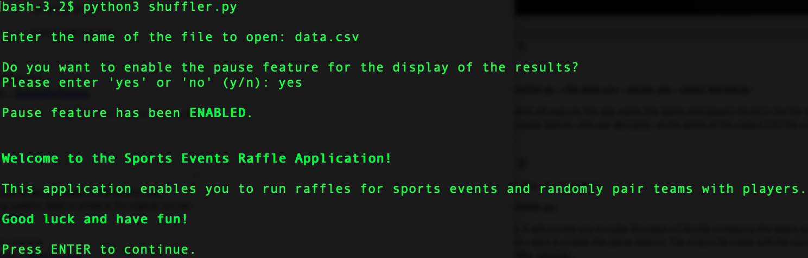

# Sports Events Raffle Application

This application allows you to run raffles for sports events. All you have to do is provide a CSV file with the names of teams and players, and the app will take care of the rest, as it will shuffle the names and randomly pair them up.

The following parameters can be passed to the app:

- `--file`: name of the CSV file containing the names of TEAMS and PLAYERS.
- `--pause`: this feature inserts pauses during the execution, particularly when the pairing of teams and players is being displayed, adding more excitement and suspense to the game. Valid values are `'yes'` or `'no'` (`y` or `n`).
- `--event`: name of the event. If provided, it will be used to name the output file with the results.

You can also execute the app without passing any arguments and it will prompt you for the required parameters. 

The app will parse the CSV file and will pair each team with a player and will write the results in another CSV file. If there are more teams than players, the app will randomly assign an equal number of teams to each player. For example, if you have 32 teams and 8 players, the app will randomly assign 4 teams to each player. In the case of an odd number, the app will do its best to evenly distribute the teams, but some lucky players will end up with an extra team. If there are more players than teams, the app will halt and ask you to fix this, as this scenario is not allowed.

The CSV file must contain the headers **TEAMS,PLAYERS** otherwise tha app will not work. A CSV file (`data.csv`) is provided as en example.

## Instructions

### Example 1:

Passing arguments:

**python3 shuffler.py --file data.csv --pause yes --event WorldCup**

This command will execute the app, parse the teams and players found in the file `data.csv`, enable the pause feature, and use `WorldCup` as the prefix of the output CSV file containing the results.

### Example 2:

Without passing any arguments:

**python3 shuffler.py**

 If you do so, it will prompt you to enter the name of the file containing the teams and players, and ask if you want to enable the pause feature. The output file name with the results will have the prefix `results`.
 
 
 
 ### Example 3:

Just passing one argument:

**python3 shuffler.py --file data.csv**

In this case, the app will take the provided argument and only will ask if you want to enable the pause feature.